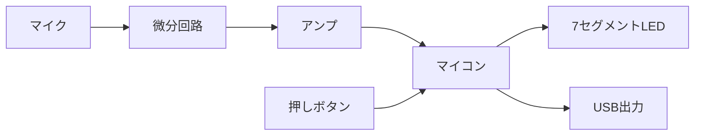
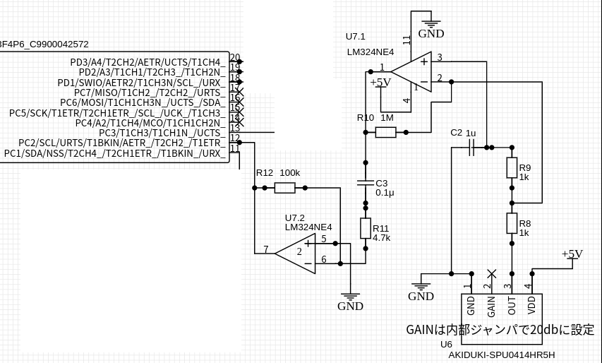
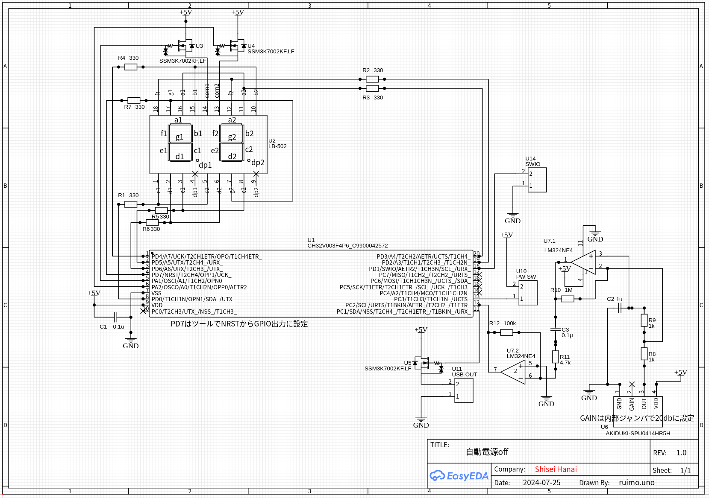

# 設計

## 全体構成

全体の構成はこんな感じ。

マイクで集音して、微分回路を通す。これでエアコンの音など常に発生している音には反応しないようにする。微分回路の出力を更にアンプで増幅してマイコンの入力ポートに接続。マイコンには入力レベル変化割込が使えるものを使用した。動作が分かるように2桁の7セグメントLEDを付けて電源offまでの残り時間(分)を表示するようにした。電源の制御は昔購入したUSB制御のテーブルタップが遊んでいたので活用した。

これはUSBに電源が供給されるとタップの電源が入るようになっている。持っていなければソリッドステートリレーなり、リレーなり使えば良いと思う。

また手動で電源on/offできるように押しボタンスイッチを付けた。時間が経過していなくてもこれを押せば電源を切断できる。逆に時間が経過して自動電源offになった場合はマイク入力では電源onにならず押しボタンを押すことで電源をonにできる。

## マイク

秋月電子のシリコンマイクを使用。中に20dBのアンプが入っている。

アンプは単電源OpアンプLM324を使用。2回路しか使っていないので4回路入りのLM324でなくても良いのだが、秋月で30円なので2回路分は遊ばせている。初段は+入力側にコンデンサを入れてあるので、簡単な微分回路になっていて急峻な信号変化のみに反応するようになっている。最後はマイコンのポートCに入力。このポートは入力変化割込が設定できるようになっている。

## マイコン

今回は7セグメントLEDの駆動が必要なのでピン数の多いCH32V003F4P6を使用。

## その他

あとは特殊な部品は使っていない。回路図はこちら。

今回は[EasyEDA](https://easyeda.com)で回路を描いて、[JLCPCB](https://jlcpcb.com)で基板を作ってもらった。一応[EasyEDA形式](SCH_Auto-power-off_2024-08-13.json)でexportしてみた(そのまま使えるのか不明)。

EasyEDAは無料で使えて回路図を描くと基板のレイアウトも自動配線でできてしまう。そのままメニューにJLCPCBに発注というのがあって今回の基板サイズなら送料入れて5枚で$3以下で造ることが可能で、金銭感覚がおかしくなる。使いかたはとても簡単なので、YouTubeとかでEasyEDAで検索して幾つか見ると使えるようになると思う。基板がこの価格で造れるようになるとユニバーサル基板とかもう使わなくなりそう。

